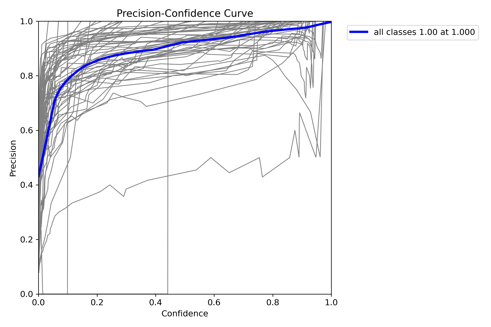
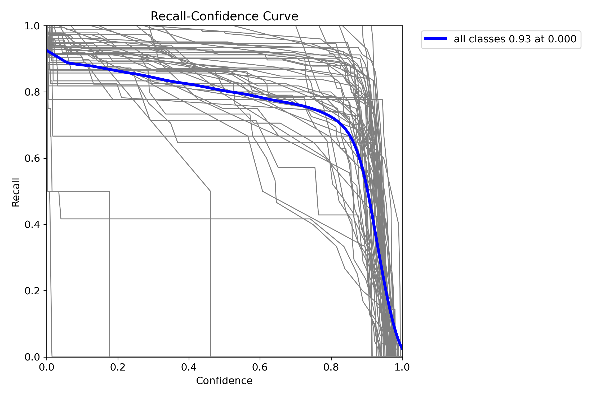
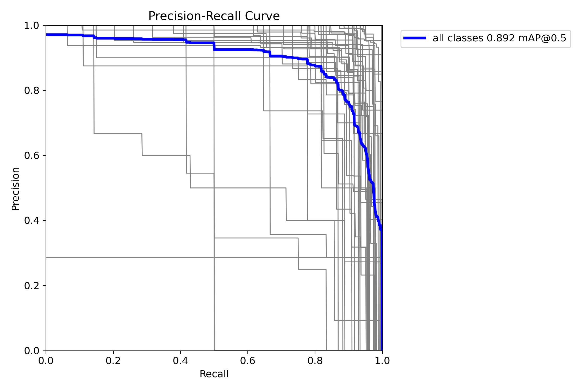
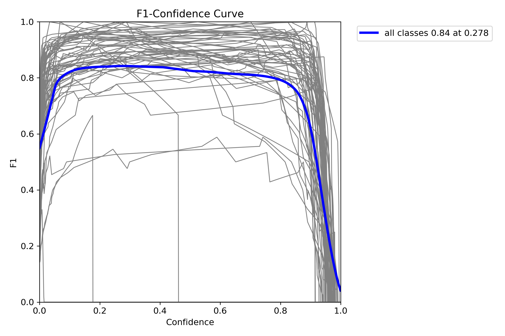
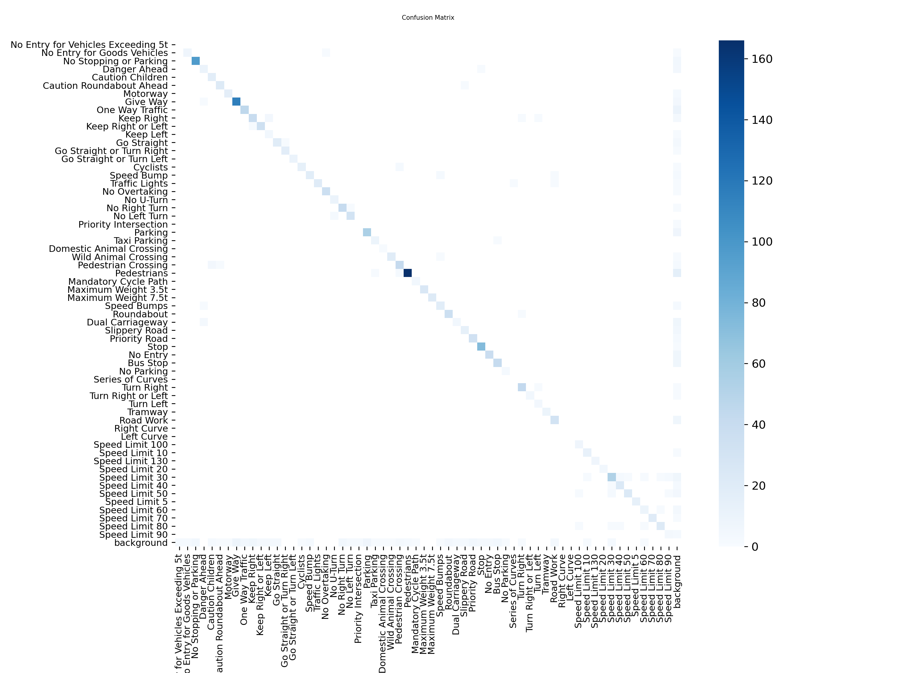
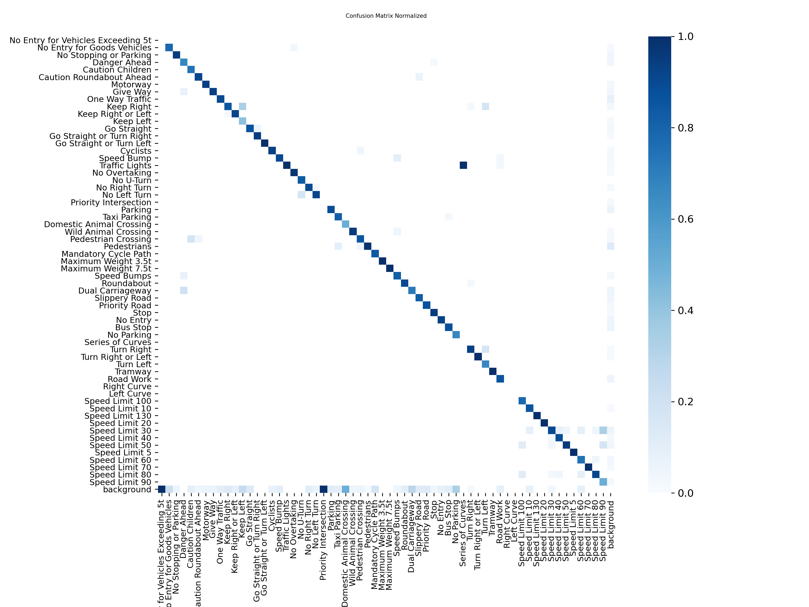
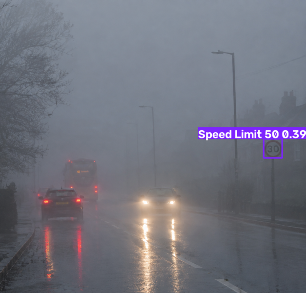
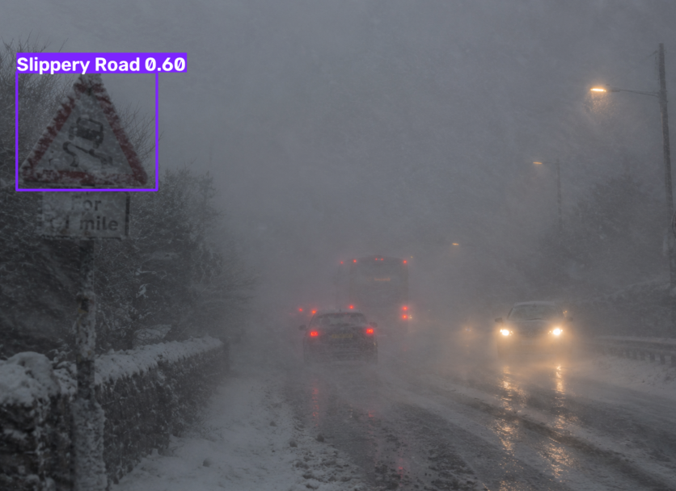

<div align="center">

# 🚦 Traffic Sign Detection — 61-Class Big Dataset Model

**A YOLOv8-based object detection model for real-time traffic sign & traffic light recognition**


</div>

---

## 📑 Table of Contents

1. [Overview](#-overview)
2. [Requirements](#-requirements)
3. [Project Structure](#-project-structure)
4. [Data](#-data)
5. [Installation](#-installation)
6. [Project Methodology](#-project-methodology)
7. [Visualization](#-visualization)
8. [Technology Used](#-technology-used)
9. [Future Improvements](#-future-improvements)

---

## 🔎 Overview

This project fine-tunes a pretrained **YOLOv8s** model to detect and classify **61 types** of traffic signs and traffic lights. It builds on an earlier 34-class version by moving to a larger, more diverse Roboflow dataset, translating French class labels to English, and injecting **harsh-condition augmentation** (fog, rain, motion blur, low light, occlusion) into training data so the model generalizes better to real-world driving conditions.

| Metric | Score |
|---|---|
| 🎯 Precision | **0.879** |
| 🔁 Recall | **0.850** |
| 📦 mAP50 | **0.892** |
| 📊 mAP50-95 | **0.754** |

---

## ⚙️ Requirements

- Python 3.10+
- NVIDIA GPU (trained/tested on a Tesla T4, via Google Colab)
- Google Drive (used for persistent storage of dataset/checkpoints)
- Roboflow API key ([get one free here](https://app.roboflow.com/settings/api))

**Python packages:**
```
ultralytics
roboflow
albumentations
opencv-python
matplotlib
PyYAML
tqdm
```

---

## 🗂️ Project Structure

```
Diploma Major Project(DCSE691)/
└── updated Model with 61 classes/
    ├── dataset/
    │   ├── train/
    │   │   ├── images/
    │   │   └── labels/
    │   ├── valid/
    │   ├── test/
    │   └── data.yaml
    ├── TrafficSign_TrainedModel_BigData/        # first training run
    ├── TrafficSign_TrainedModel_BigData_continued/
    │   └── weights/
    │       ├── best.pt
    │       └── last.pt
    └── Test_Prediction_Results/                 # saved inference outputs
```

---

## 📊 Data

- **Source:** Roboflow — *"Traffic Signs and Traffic Lights"* (workspace: `raouf-xjwsn`, project: `raouf`)
- **Classes:** 61 (originally French-labeled, translated to English — e.g. `Vitesse limitee` → `Speed Limit`, `Cedez le passage` → `Give Way`)
- **Validation set:** 861 images, 1,673 labeled instances
- **Format:** YOLOv8 (`data.yaml`)
- **Augmentation:** Synthetic fog, rain, motion blur, low brightness, and occlusion patches applied to the **training split only** — validation/test are kept clean for a fair, unbiased evaluation.

---

## 🛠️ Installation

```bash
# 1. Clone the repository
git clone <your-repo-url>
cd <your-repo-folder>

# 2. Install dependencies
pip install -q ultralytics roboflow albumentations

# 3. Set your Roboflow API key
export ROBOFLOW_API_KEY="your-api-key-here"

# 4. Run the notebook / training script
```

---

## 🧭 Project Methodology

1. **Environment setup** — verify GPU availability, install core libraries
2. **Mount storage** — connect Google Drive for persistent dataset/model storage
3. **Download dataset** — pull the labeled dataset from Roboflow (cached after first run)
4. **Fix `data.yaml`** — convert relative paths to absolute so training doesn't break
5. **Translate class names** — map French label names to English equivalents
6. **Harsh-condition augmentation** — apply fog/rain/blur/brightness/occlusion transforms to the training set only
7. **Train** — fine-tune `yolov8s.pt` for 100 epochs, with checkpoint-resume support
8. **Evaluate** — run `model.val()` on the held-out validation split
9. **Predict** — run inference on the test set and on manually uploaded images
10. **Export** — export the final model to **ONNX** for deployment

**Training configuration:**

| Parameter | Value |
|---|---|
| Epochs | 100 |
| Image size | 640 |
| Batch size | 16 |
| Patience (early stopping) | 20 |
| Seed | 42 |
| Horizontal / vertical flip | 0 / 0 |
| Rotation (degrees) | 5 |
| Translate | 0.10 |
| Scale | 0.30 |
| Shear | 2.0 |
| Perspective | 0.0005 |
| HSV (h / s / v) | 0.015 / 0.70 / 0.40 |

---

## 📈 Visualization

All evaluation plots below are generated automatically by Ultralytics (`plots=True`) and live in the [`results/`](./results) folder.


| Current filename | Rename to |
|---|---|
| `BoxF1_curve.png` | `F1_confidence_curve.png` |
| `BoxPR_curve.png` | `precision_recall_curve.png` |
| `BoxP_curve.png` | `precision_curve.png` |
| `BoxR_curve.png` | `recall_curve.png` |
| `confusion_matrix.png` | `confusion_matrix.png` *(keep as is)* |
| `confusion_matrix_normalized.png` | `confusion_matrix_normalized.png` *(keep as is)* |
| `result 1.png` | `sample_prediction_1.png` |
| `result 2.png` | `sample_prediction_2.png` |

### Precision, Recall & F1

<table>
<tr>
<td></td>
<td></td>
</tr>
<tr>
<td align="center"><sub>Precision-Confidence Curve</sub></td>
<td align="center"><sub>Recall-Confidence Curve</sub></td>
</tr>
<tr>
<td></td>
<td></td>
</tr>
<tr>
<td align="center"><sub>Precision-Recall Curve</sub></td>
<td align="center"><sub>F1-Confidence Curve</sub></td>
</tr>
</table>

### Confusion Matrix

<table>
<tr>
<td></td>
<td></td>
</tr>
<tr>
<td align="center"><sub>Confusion Matrix</sub></td>
<td align="center"><sub>Normalized Confusion Matrix</sub></td>
</tr>
</table>

### Sample Predictions

<table>
<tr>
<td></td>
<td></td>
</tr>
<tr>
<td align="center"><sub>Detection on test image #1</sub></td>
<td align="center"><sub>Detection on test image #2</sub></td>
</tr>
</table>

---

## 🧰 Technology Used

| Category | Tools |
|---|---|
| Model |  |
| Framework |  |
| Data augmentation |  |
| Dataset hosting |  |
| Compute |  |
| Image processing |  |
| Export format |  |

---

## 🚀 Future Improvements

- ⚖️ Address class imbalance — several classes have very few labeled examples, hurting per-class accuracy
- 🇮🇳 Fine-tune or extend with India-specific traffic sign data (current dataset is not India-specific)
- 📱 Deploy the ONNX model to a lightweight edge/mobile app for real-time detection
- 🎥 Add video-stream inference support, not just static images
- 🧪 Run systematic hyperparameter tuning (learning rate, augmentation strength) instead of fixed values
- 📦 Package as a reusable pip module / API endpoint for easy integration into other projects

---

<div align="center">
Made with YOLOv8 · Trained on Google Colab · Author: Ankit Kumar Jha
</div>
